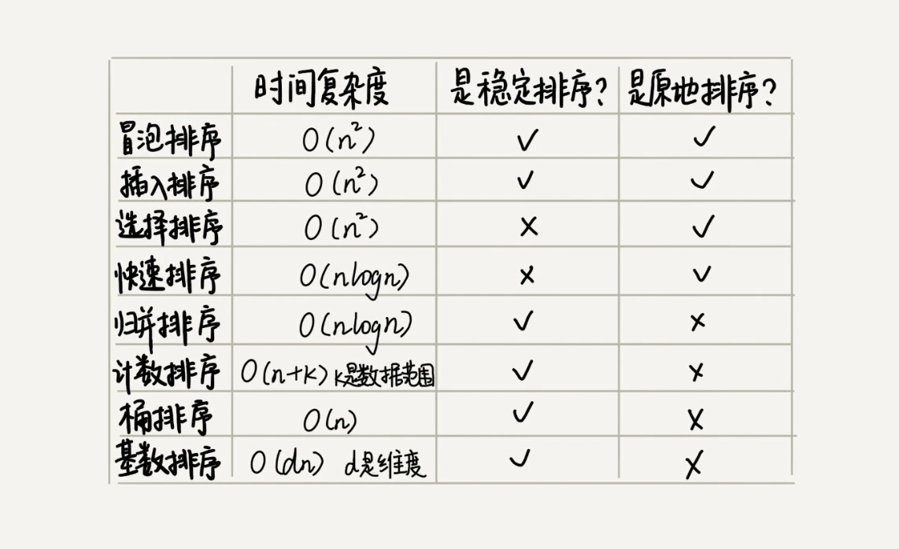

# 排序
排序算法是计算机领域中最常用的算法，大部分的编程语言中，也都提供了排序函数。对于平常的业务项目，我们经常也会用到排序。比如对于数据按创建时间倒序、按某个具体的数据升序排列等。

## 如何分析排序算法
衡量一个排序算法的执行效率和优劣，一般从以下几个方面衡量：

### 1.最好情况、最坏情况、平均情况时间复杂度
在分析排序算法的时间复杂度时，要分别给出最好情况、最坏情况、平均情况下的时间复杂度。除此之外，你还要说出最好、最坏时间复杂度对应的要排序的原始数据是什么样的。

### 2.时间复杂度的系数、常数 、低阶
时间复杂度反映的是数据规模 n 很大的时候的一个增长趋势，所以它表示的时候会忽略系数、常数、低阶。但是在实际的场景中，对于数据规模比较小，例如100、1000等这样的数据规模，在对同一阶时间复杂度的排序算法性能对比的时候，就要把系数、常数、低阶也考虑进来。

### 3.比较次数和交换（或移动）次数
基于比较的排序算法的执行过程，会涉及两种操作，一种是元素比较大小，另一种是元素交换或移动。所以，在分析排序算法的执行效率的时候，应该把比较次数和交换（或移动）次数也考虑进去。

### 4.排序算法的内存消耗
排序算法除了考虑时间复杂度，空间复杂度也不能忽略，这时候就要引入一个新的概念：**原地排序（Sorted in place）**。原地排序算法就是特指空间复杂度是 O(1) 的排序算法。

对于冒泡、插入、选择排序、希尔排序等算法都属于原地排序算法，而归并排序就不是。**如果需要考虑内存，大规模数据的时候就不适合使用归并排序**。

### 5.排序算法的稳定性
针对排序算法，还有一个重要的度量指标：**稳定性**。这个概念是说，如果待排序的序列中存在值相等的元素，经过排序之后，相等元素之间原有的先后顺序不变。

## 分类
排序算法按时间复杂度主要分为三类：
- 初级排序算法，时间复杂度为 O($n^2$)，主要有冒泡排序、插入排序、选择排序、希尔排序等，适合小规模数据排序；
- 高级排序算法，时间复杂度为 O($nlogn$)，主要有归并排序、快速排序等，适合大规模数据排序；
- 线性排序算法，时间复杂为 O($n$)，主要有桶排序、计数排序、基数排序等，适合特殊数据的场景。

用一张图归纳：

## 排序算法的适用场景
- **插入排序**，在小规模数据排序场景中，在几种初级算法中，插入排序比较合适；
- **快速排序**，适合用来实现编程语言的通用排序算法，但是要注意优化取分区点的算法，比如利用三数取中法、随机法等，对于不同的数据规模，可以考虑降级地其它排序算法，对于对内存充足的时候，可以考虑归并排序，对于小规模数据，可以降级到插入排序；
- **桶排序**，比较适合用在外部排序中。所谓的外部排序就是数据存储在外部磁盘中，数据量比较大，内存有限，无法将数据全部加载到内存中；
- **计数排序**，只能用在数据范围不大的场景中，如果数据范围 k 比要排序的数据 n 大很多，就不适合用计数排序了。而且，计数排序只能给非负整数排序，如果要排序的数据是其他类型的，要将其在不改变相对大小的情况下，转化为非负整数;
- **基数排序**，它对要排序的数据是有要求的，需要可以分割出独立的“位”来比较，而且位之间有递进的关系，如果 a 数据的高位比 b 数据大，那剩下的低位就不用比较了。除此之外，每一位的数据范围不能太大，要可以用线性排序算法来排序，否则，基数排序的时间复杂度就无法做到 O(n) 了。

## 实现一个通用的、高性能的排序函数
虽然桶、计数、基数排序是时间复杂度为 O($n$) 的排序函数，但是使用场景比较特殊，所以不适合用来作为通用的排序函数。

如果对小规模数据进行排序，可以选择时间复杂度是 O($n^2$) 的算法；如果对大规模数据进行排序，时间复杂度是 O($nlogn$) 的算法更加高效。所以，为了兼顾任意规模数据的排序，一般都会首选时间复杂度是 O($nlogn$) 的排序算法来实现排序函数。

虽然快排和归并排序都是时间复杂度为 O($nlogn$) 的算法，快排最坏的情况下时间复杂度是 O($n^2$)，而归并排序可以做到平均情况、最坏情况下的时间复杂度都是 O($nlogn$)，但是使用归并排序的场景并不多。 

因为归并排序并不是原地排序算法，空间复杂度是 O(n)。所以，粗略点、夸张点讲，如果要排序 100MB 的数据，除了数据本身占用的内存之外，排序算法还要额外再占用 100MB 的内存空间，空间耗费就翻倍了。

所以要实现一个通用的排序函数，一般选择快速排序算法，但是我们要优化快速排序算法。因为如果数据原来就是有序的或者接近有序的，每次分区点都选择最后一个数据，那快速排序算法就会变得非常糟糕，时间复杂度就会退化为 O(n2)。实际上，**这种 O(n2) 时间复杂度出现的主要原因还是因为我们分区点选得不够合理**。

为了优化快排分区点的选择，业界有两个常用的分区的算法：
- **三数取中法**，我们从区间的首、尾、中间，分别取出一个数，然后对比大小，取这 3 个数的中间值作为分区点。这样每间隔某个固定的长度，取数据出来比较，将中间值作为分区点的分区算法，肯定要比单纯取某一个数据更好。下面的算法实现中有三数取中的快排实现，有兴趣可以看下。

- **随机法**，随机法就是每次从要排序的区间中，随机选择一个元素作为分区点。这种方法并不能保证每次分区点都选的比较好，但是从概率的角度来看，也不大可能会出现每次分区点都选得很差的情况，所以平均情况下，这样选的分区点是比较好的。

通用排序算法举例：
- C 语言中的 `qsort()` 实现，qsort() 会优先使用归并排序来排序输入数据，要排序的数据量比较大的时候，qsort() 会改为用快速排序算法来排序，qsort() 选择分区点的方法就是“三数取中法”；qsort() 并不仅仅用到了归并排序和快速排序，它还用到了插入排序。在快速排序的过程中，当要排序的区间中，元素的个数小于等于 4 时，qsort() 就退化为插入排序；

- JavaScript 中的 sort 实现。

## 算法实现
- [冒泡排序](../algorithm/sorter/bubbleSort.ts)
- [插入排序](../algorithm/sorter/insertSort.ts)
- [选择排序](../algorithm/sorter/selectSort.ts)
- [希尔排序](../algorithm/sorter/shellSort.ts)
- [归并排序](../algorithm/sorter/mergeSort.ts)
- [快速排序](../algorithm/sorter/quickSort.ts)
- [三数取中快速排序](../algorithm/sorter/threeWayQuickSort.ts)
